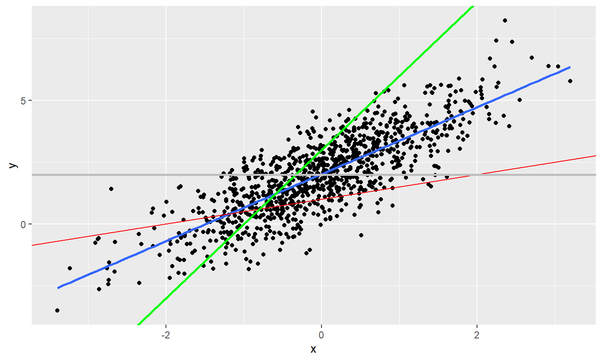

# Introduction

## Agenda for today's lecture

- **Objective of the Lecture:** Introcuction of the Linear Regression Model and its relation to the Conditional Expectation Function
- **Also Covered:** Define and explain the concept of the Conditional Expectation Function (CEF) and its relevance for Linear Regression.
- **Brief Overview of CEF:** Introduction to the concept of expectation in statistics and how it extends to conditional expectation.
- Learn that **linear regression is a special case of the CEF**.

# Review of expectation, variance, and their properties

## Expectation

- **Expectation of a Discrete Random Variable \(X\)**  
  The expectation of a discrete random variable \(X\), where the probability mass of \(x \in X\) is given by \(p(x)\), is defined by: 
  $$\sum(x \cdot p(x))$$

- **Expectation of a Continuous Random Variable \(X\)**  
  The expectation of a continuous random variable \(X\), whose density is \(f(x)\), is defined by: 
  $$\int f(x) \cdot x \, dx$$

---

- **Expectation of a Function \(h(X)\) of \(X\)**  
  Similarly, for the same variable \(X\) above, the expectation of a function \(h(X)\) is given by 
  $$\int f(x) \cdot h(x) \, dx$$ 
  and similarly for the discrete case.

- **Reminder: the expectation is a population concept.**

## Variance

- **Variance of a random variable \(X\)** 
$$Var(X) = \mathbb{E}[(X - \mathbb{E}[X])^2]$$

## Covariance

- **Covariance between two random variables \(X\) and \(Y\)**

$$Cov(X,Y) = \mathbb{E}[(X -  \mathbb{E}[X])*(Y -  \mathbb{E}[Y])]$$

- Note that \(Cov(X,X) = Var(X)\).

- Covariance is positive when both \(X\) and \(Y\) tend to have values above (or below) their means simultaneously, and negative when one is above and the other below their respective means.

## Algebra with Expectation, Variance, and Covariance

1. **Linearity of Expectation**
   $$\mathbb{E}[aX + bY] = a*\mathbb{E}[X] + b*\mathbb{E}[Y]$$

2. **Variance Identity**
   $$Var(X) = \mathbb{E}[X^2] - \mathbb{E}^2[X]$$

3. **Covariance Identity**
   $$Cov(X,Y) = \mathbb{E}[X*Y] - \mathbb{E}[X]*\mathbb{E}[Y]$$

## Algebra with Expectation, Variance, and Covariance (cont.)

<ol start=3>
<li> **Covariance Symmetry**
   $$Cov(X,Y) = Cov(Y,X)$$

<li> **Variance Nonlinearity**
   $$Var(a*X + b) = a^2*Var(X)$$

<li> **Covariance Nonlinearity**
   $$Cov(a*X + b,Y) = a*Cov(Y,X)$$
</ol>

# Linear Regression Model

## Deterministic Model
- On eof the simplest model we could use is a deterministic model of the world.

- A deterministic linear model is expressed as: 

\[
\begin{equation}
Y_{i} = \alpha + \beta X_{i}
\tag{1}
\end{equation}
\]

- A deterministic model is __systematic__ and contains no error, therefore _$Y$ is supposed to be perfectly predicted by $X$_. This is illustrated in the next slide.

## Derterministic model - cont.

-  $\alpha$ and $\beta$ are the model parameters, and are constant terms. $\beta$ is the slope, or the change in $Y$ over the change in $X$. $\alpha$ is the intercept, or the value of $Y$ when $X$ is zero.  

## Stochastic Linear Model

- In practice, our models are never perfect and it makes sense to include the possibility that they will make errors.
- Thus, we can add an error to the model.
- That is why sometimes we say the linear model is composed of a systematic and a random (Latin word for the Greek *stochastic*) term.

\[
\begin{equation}
Y_{i} = \alpha + \beta X_{i} + \epsilon_i
\tag{2}
\end{equation}
\]

where \(\epsilon_i\) is the error term.

# Conditional Expectation

## Introducing the CEF

- Suppose we know the value of some variable \(X\), like education, and we want to use it to predict \(Y\), say, wage.

- Instead of summarising the conditional distribution of \(Y\) given \(X\) with $\mathbb{E}[Y]$, we will use the conditional expectation when \(X\) takes a particular value \(x\): $\mathbb{E}[Y|X=x]$

- sometimes $\mathbb{E}[Y|X]$ for shorthand

- If \(Y\) is discrete, with values $\{y_1,  \dots , y_m\}$, then:
$$\mathbb{E}[Y|X=x] = \sum^{m}_{j=1}y_j\cdot P_{Y|X=x}(y_j|X=x)$$

## Properties of Conditional Expectation

<ol>
<li> $\mathbb{E}[f(X)|x] = f(x)$, for any function $f$.
For example, $\mathbb{E}[X^2|X] = X^2$

<li> For any functions f(x) and g(x):
$$\mathbb{E}[f(X)Y + g(X)|X] = f(X)\mathbb{E}[Y|X] + g(x)$$
For example, $\mathbb{E}[XY + 2X^2|X] = X\mathbb{E}[Y|X] + 2X^2$
<li> If $X$ and $Y$ are independent, then $\mathbb{E}[Y|X] =\mathbb{E}[Y]$.
In particular, if $X$ and $U$ are independent, and $\mathbb{E}[U] = 0$, then $\mathbb{E}[U|X] = 0$.
<ol>

## Properties of Conditional Expectation (cont.)

<ol start=3>
<li> Law of Iterated Expectations (LIE): $\mathbb{E}[\mathbb{E}[Y|X]] =\mathbb{E}[Y]$

Let's say we have the average wage conditional on gender (male, female). The unconditional expectation is a weighted sum of the average wage for men and women. Which it is exactly the expectation of a conditional expectation.

<li> If $\mathbb{E}[Y|X] = \mathbb{E}[Y]$, then $Cov(X,Y) = 0$

<li> Properties 3 and 4 together implies that if $U$ and $X$ are random variables such that $\mathbb{E}[U|X] = 0$, then $\mathbb{E}[U] = 0$ and $U$ and $X$ are uncorrelated.
<ol>

## Conditional Expectation Function

- We can compute for the population the conditional expectation for every educational level

- We can also present the relationship as a function.

- Let's say the **Conditional Expectation Function** is:
$$\mathbb{E}[WAGE|EDUC] = 1.05 + .45EDUC$$

- The coefficient of .45 on EDUC implies that one year of education increases, on average (or in expectation) the wage in .45 monetary units 

## CEF as the Optimal Predictor

- CEF is acknowledged as the best global predictor ever.
- As measured by the Mean Squared Error (MSE).
- Basis for various predictors in regression and machine learning.
- Advanced AI, including Large Language Models like ChatGPT, cannot surpass CEF in prediction.

## Utilizing CEF

- True form of CEF is unknown.
- Focus on approximating CEF with linear regression.
- Exploring approximation properties and conditions.
- Linking CEF with predictive and causal models.

## Conditional Expectation Function (CEF) for Multiple Predictors

- The CEF can be written for multiple predictors as $\mathbb{E}[Y| X_1, X_2, ..., X_k] = m(x_1, x_2, ..., x_k)$.

- For a single predictor \(X\), it's $\mathbb{E}[Y| X] = m(X)$.

## CEF Error

<ol>
<li> The prediction error in the CEF is defined as: 
$$e = Y - m(X)$$

<li> Hence $Y = m(X) + e$.

<li> One of the properties of conditional expectation is that:

$$
\mathbb{E}[m(X)|X] = m(X)
$$
<ol>

## CEF Error (cont.)
- This property leads to the conditional expectation of the error \(e\) being zero:

\(\mathbb{E}[e|X] = \mathbb{E}[Y - m(X)|X]\)  
\(= \mathbb{E}[Y|X] - \mathbb{E}[m(X)|X]\)  
\(= m(X) - m(X)\ = 0)  

## Unconditional Expectation of Error

- The unconditional expectation of the error term \(e\) is zero:

$$
\mathbb{E}[e] = 0
$$

- We can show it using the Law of Iterated Expectations:

$$
\mathbb{E}[\mathbb{E}[Y|X]] = \mathbb{E}[Y]
$$

$$
\mathbb{E}[e] = \mathbb{E}[\mathbb{E}[e|X]] = \mathbb{E}[0] = 0
$$

## CEF error is uncorrelated with X

- The error of the CEF is uncorrelated with any function of \(X\).
- Formally: \(\mathbb{E}[h(x) \cdot e] = 0\). Particularly, for \(h(x) = x\), it's \(\mathbb{E}[x \cdot e] = 0\).
- This implies error independence from \(X\) on average.
- Knowing \(X\) doesn't change the error's average estimate.

## Why \(\mathbb{E}[x \cdot e] = 0\) implies uncorrelatedness between X and error

- The covariance between two variables \(x\) and \(e\) is defined as:

\[
\text{Cov}(x, e) = \mathbb{E}[(x - \mathbb{E}[x])(e - \mathbb{E}[e])]
\]

- Expanding the covariance formula:

\[
\begin{aligned}
\text{Cov}(x, e) &= \mathbb{E}[x \cdot e - x \cdot \mathbb{E}[e] - \mathbb{E}[x] \cdot e + \mathbb{E}[x] \cdot \mathbb{E}[e]] \\
&= \mathbb{E}[x \cdot e] - \mathbb{E}[x] \cdot \mathbb{E}[e] - \mathbb{E}[x] \cdot \mathbb{E}[e] + \mathbb{E}[x] \cdot \mathbb{E}[e] \\
&= \mathbb{E}[x \cdot e] - \mathbb{E}[x] \cdot \mathbb{E}[e]
\end{aligned}
\]

## Implication for Correlation

If the error term \(e\) has an expected value of zero (\(\mathbb{E}[e] = 0\)), then:

\[
\text{Cov}(x, e) = \mathbb{E}[x \cdot e]
\]

Hence, if \(\mathbb{E}[x \cdot e] = 0\), it implies no correlation between \(x\) and \(e\).

## Variance

- The variance of the error is: $\mathbb{E}[e^2] - \mathbb{E}^2[e] = $\mathbb{E}[e^2] - \mathbb{E}[e]\mathbb{E}[e]$
- Since, \mathbb{E}[e] = 0, then $\mathbb{E}[e^2] = \sigma^2$ is the variance.
- If we add more covariates, the variance decreases.
- Conditional variance $\mathbb{E}[e^2|X] = var(y|x)$
- homoskedastic: this variance does not depend on x
- heteroskedastic: this variance does depend on x

## Linear CEF

- Let $m(x) = \alpha + \beta x$
- Let $y = m(x) + e = \alpha + \beta x + e$
- We will suppose that the CEF is linear or that we can approximate the true CEF with a linear one.
- It is linear in parameters $\alpha$ and $\beta$

## Linear Regression

<!-- -->

## Linear Regression and Conditional Expectation Function

- Linear regression is a **special case of the CEF**

## Assuming CEF is Linear (Justification I)

- If CEF is linear, use regression lines for estimation.
- Occurs in scenarios like normal joint distribution of \(Y\) and \(X\), or in "saturated" models.
- See "Mostly Harmless Econometrics", chap. 3, for detailed explanation.

## Best Linear Predictor of \(Y\) (Justification II)

- Linear regression model provides the best prediction among linear models.
- Focuses on minimizing the error between observed \(Y\) and the linear model.
- Minimizes squared difference between $Y$ and $m(x)$ - aka the error
- Interpretation: "Regression provides the best linear predictor for the $Y$ in the same way that the CEF is the best unrestricted predictor of $Y$" (MHE, p. 38).

## Regression Line as Best Approximation (Justification III)

- Here the focus is on approximation rather than prediction.
- Best approximation of a non-linear CEF is through the regression formula.
- Minimizes the difference between \(\mathbb{E}[Y|X]\) - aka the true CEF - and \(m(x)\) - the approximated linear CEF.
- Interpretation: "if we prefer to think about approximating  \(\mathbb{E}[Y|X]\), as opposed to predicting Y, (...), even if the CEF is nonlinear, regression provides the best linear approximation ot it" (MHE, p. 38).
- Justification 3 is their favorite: describe essential features of the data, without trying to be exact.

## CEF and Causality

- Even though the CEF is uncorrelated with the error (by definition), it is not (in itself) a causal model. 
- To talk about causality we need a causal model, sometimes called structural model
- Using the Potential Framework developed by Rubin (for instance), we can write a causal model
- 
